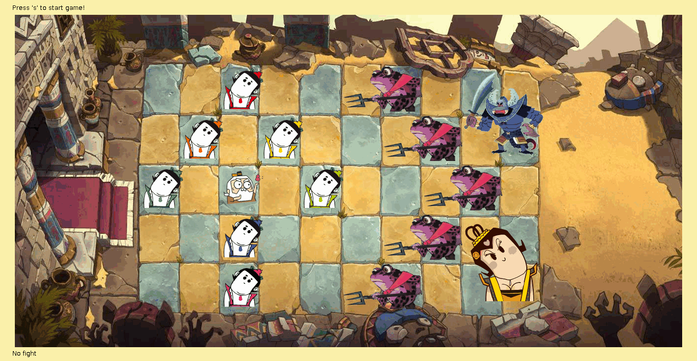

葫芦娃大战妖精
===========

##精彩回放


##依赖关系
- JDK >= 1.8
- Maven >= 4.0.0
- JUnit >= 4.12

##构建
```
git clone https://github.com/tangruize/huluwa.git
cd huluwa
mvn clean test package
java -jar target/huluwa-1.0.jar
```

##操作说明
战场为10x5的矩阵, 葫芦娃和爷爷只占一个格子, 蛤蟆精占两个格子, 蝎子精和蛇精占4个格子.
总共有5个关卡, 分别有不同的队形和玩家类型和数量.
按`s`开始本关游戏, `r`重新开始本关游戏. 如果葫芦娃输了这一关, 将重新从第一关开始. (所有快输了的时候要及时按下`r`...)
爷爷是你唯一可以控制的角色, 按`s`或者`空格`开始后, 所有的玩家都开始活动, 爷爷默认也自由活动. 如果按下`方向键`后, 爷爷就需要你控制, 即`方向键`控制移动. 再按一下`s`爷爷又可以自由活动了.
与敌人战斗的方式是碰撞, 如果你尝试向敌人所在区域移动, 就会发生一次战斗. 战斗有四种结果: 你死, 我死, 大家死, 都不死. 这是靠概率来决定谁死谁活的. 死亡概率如下:
1. 同类之间都不会死, 但不能向对方所在区域移动.
2. 葫芦娃 vs 蝎子精: 70%, 15% (葫芦娃人多嘛, 况且蝎子精还有剧毒)
3. 葫芦娃 vs 蛇精: 60%, 10% (蛇精太聪明了还有如意, 不容易死, 然而她喜欢把葫芦娃抓起来甚至养起来...)
4. 葫芦娃 vs 蛤蟆精: 15%, 80% (葫芦娃真本事, 小喽啰太过自信)
5. 爷爷 vs 蝎子精: 50%, 5% (爷爷压根不是蝎子精对手, 但闪得很快 )
6. 爷爷 vs 蛇精: 10%, 70% (成熟老练的爷爷专克蛇精)
7. 爷爷 vs 蛤蟆镜: 70%, 10% (凡人打不过妖精, 小妖精们素质低下, 抓住就杀了)
综上, 你唯一能控制的爷爷不要轻易去与蛤蟆精和蝎子精决斗. 蛤蟆镜交给葫芦娃就好了, 稳稳的. 而蝎子精虽然像bug一样的存在, 毕竟人少, 只要葫芦娃人数够多, 应该能够胜利. 所以要保护葫芦娃不要被蛇精吃了, 尽量与蛇精决斗并躲开其他妖精.
战斗回放请按`l`键, 然后选择一个录制文件. 这个录制文件在游戏每一关开始时都会重新生成, 默认名为"huluwa.log". 可以在战斗开始前按`w`键更改一个保存的位置.
如果在游戏过程中退出, 录制文件停留在退出时的状态, 可通过`c`键选择该文件(与没有计时的`l`键功能相同), 或通过`l`选择录制文件并在查看完毕时, 按`s`键继续游戏, 如果在查看过程中按了`r`键, 将重新开始本关.

##设计说明
我使用了曹老师提供的代码框架, 该框架已经配置好键盘, 显示等事件, 玩家类也提供了多线程模板. 在此基础上, 我主要修改了Field类, 该类管理各个玩家的活动. 修改并扩展了Player类, 产生多种不同玩家. 修改了Thing2D类, 使得玩家坐标为10x5的格子, 而不是像素点. 增加了Record类, 用于处理回放功能.
###继承和多态

Thing2D存储了图片信息和坐标信息, 用于显示. 
继承类Player实现了Runnable接口可以多线程活动.
不同种类的玩家具有不同的属性, 继承了Player类.
一种玩家的能力主要取决于决斗时死亡的概率, 这体现了多态和动态绑定的好处. 方法`boolean getDeadProb(Player p)`获取玩家是否会死.
代码中还有诸多涉及继承的地方, 如窗口左下角打印战斗信息的名称获取等.
###文件操作
文件输入输出用到了装饰器模式, 如: 
```
Scanner scanner = new Scanner(new File(inputFileNamePath, inputFileName));
FileOutputStream fileOutput = new FileOutputStream(file, isContinue);
```
一个记录文件是一个普通的纯文本文件.
每行开头有一个int型表示执行这个操作前延迟的毫秒数.
文件第一行只有两个域, 另一个为当前所在关卡.
其他行有7个域, 前五个为int型, 后两个为boolean型. 分别代表: 延迟, 执行动作a玩家id, 涉及b玩家id(-1为没有), 动作改变的x坐标值, 动作改变的y坐标值, a玩家是否战死, b玩家是否战死. 举例:
```
0 4
1 0 1 -1 1 false false
0 10 11 -1 1 false false
0 1 -1 -1 0 false false
1 7 -1 0 0 false false
1 11 3 -1 1 true false
0 3 -1 0 1 false false
0 15 2 0 -1 false false
```
信息虽然很少但足以描述行为. 用延迟的方式使得回放过程实际上不是多线程跑的. 多线程回放不容易控制. 末尾两个域使用boolean可以用于调试, 使得读出来类型不一致抛出异常. (编写过程中的确写错了). 用这个来设置决斗中玩家必死或者必不死, 使得回放不像游戏开始那样随机.
###测试
尝试使用了JUint对某些方法进行单元测试. 比如对玩家死亡概率的测试, 因为这涉及到记录回放的工作, 必须确保回放时与原来一致.
测试了Field中关于地图的方法, 如设置和获取, 这使得多线程情况下能够正常逻辑执行.
###流程控制
程序的逻辑就是打怪升级. 每关阵法信息由一个String[]表示, 用一些标志表示这个位置应该站何种生物. 目前总共设计了5关, 难度递增. 比如第四关:
```
"..c..f..S.\n" +
".c.c..f...\n" +
"c.g.c..f..\n" +
"..c...f.s.\n" +
"..c..f....\n"
```
玩家线程随机产生x, y方向上的改变, 一次只能改变1, 然后调用move()方法, 它将检测改变的合法性, 如果合法, 将检测是否发生战斗, 并调用Field类中的"裁判"方法fight()来判断输赢. 玩家死亡会改变头像, 并且不能再移动, 但不占位置.
###多线程安全
在Field中使用了重入锁, 玩家想要移动先要获取锁, 使得记录, 地图, 战斗能够正常工作.
###异常处理
涉及到多种异常, 如读取文件, 睡眠, 获取锁等. 每种异常都经过了处理, 比如睡眠被打断只捕获, 是线程控制的正常逻辑, 没有错误. 而读取文件则可能发生文件不存在等等错误. 异常处理使得程序鲁棒性很好.
###注解
使用了Test对测试进行了注解, 所有的方法覆盖都用了Override注解.

感谢阅读!